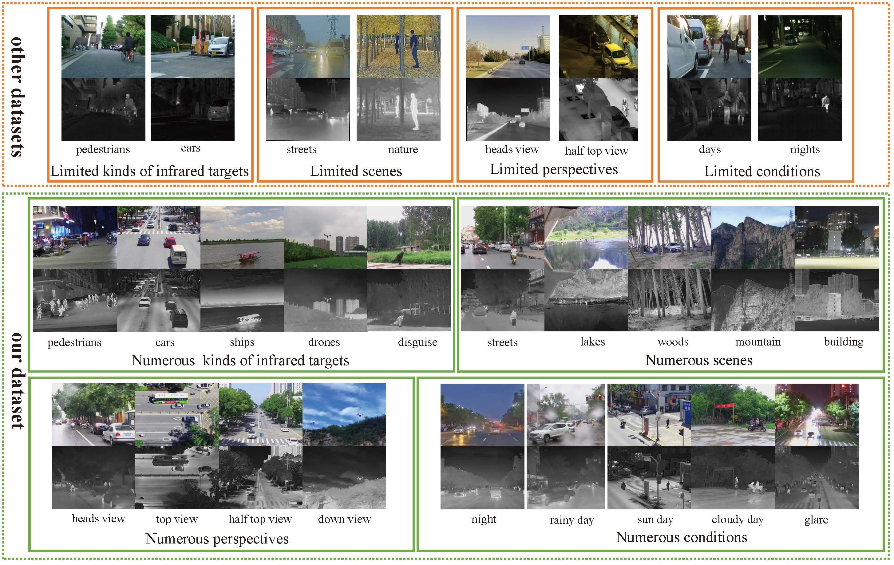
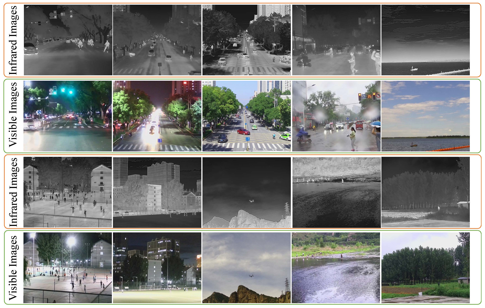

# MSIV Dataset: Multi-Scenary Infrared and Visible Image Dataset

The **MSIV** dataset is a newly proposed benchmark designed for training and evaluating infrared and visible image fusion algorithms. It contains diverse, real-world scenes captured under various environmental conditions and with multiple types of thermal targets.

> 📄 Used in the paper: [DSFuse: A Dual-Diffusion Structure for Feature Fidelity Infrared and Visible Image Fusion](https://ieeexplore.ieee.org/document/11074762), accepted by IEEE TNNLS 2025.

## 🌟 Highlights

- ✅ 7000 finely aligned infrared-visible image pairs
- ✅ Multiple target types: people, cars, ships, UAVs, camouflaged objects
- ✅ Various scenes: urban streets, natural landscapes, lakes, buildings
- ✅ Diverse conditions: daytime, nighttime, rainy weather
- ✅ High-quality annotations for detection/segmentation tasks (optional)

## 🗂 Dataset Structure

```
MSIV/

│── ir/            # Infrared images
└── vis/           # Visible images

```

- Image Format: `.png` or `.jpg`
- Aligned resolution: IR: 640×512, VI: 1280×720 → Resized to 640×480 or 360×360 during training

## 🖼 Sample Images

<p align="center">
    
  
</p>


## 📥 Download


You can download the dataset via:

```bash
git clone https://github.com/Yzhijia/Multi-Scenary-Infrared-and-Visible-images-dataset.git
```

If you need annotations for training detection models, you can download dataset with annotation:
📥 [Download MSIV Dataset for Detection](https://drive.google.com/file/d/1FW9tsDdLY-vy_eJgA8qP1a29tfgQEL54/view?usp=drive_link)  

## 🧪 Recommended Use

- Image Fusion: IR-VI image fusion for general-purpose or target-aware scenarios
- Detection: Use fused or single-modality images for object detection
- Segmentation: Segment objects under challenging conditions

Recommended preprocessing:

- Resize to 640×480 or crop to 360×360
- Normalize to [0, 1] range
- Align images using homography if necessary (already applied in this dataset)

## 📊 Related Benchmark Results

The MSIV dataset was used in the DSFuse paper to train and evaluate fusion models, showing strong generalization ability and significant performance gains across fusion, detection, and segmentation tasks.

## 📚 Citation

If you use the MSIV dataset, please cite:

```bibtex
@article{yang2025dsfuse,
  title={DSFuse: A Dual-Diffusion Structure for Feature Fidelity Infrared and Visible Image Fusion},
  author={Yang, Zhijia and Gao, Kun and Zhang, Yanzheng and Zhang, Xiaodian and Hu, Zibo and Wang, Junwei and Wang, Jingyi and Li, Wei},
  journal={IEEE Transactions on Neural Networks and Learning Systems},
  year={2025},
  doi={10.1109/TNNLS.2025.3584834}
}
```

## 📬 Contact

For questions or contributions:

**Zhijia Yang**  
School of Optics and Photonics, Beijing Institute of Technology  
📧 gaokun@bit.edu.cn

---

© 2025 MSIV Dataset Contributors. All rights reserved.
